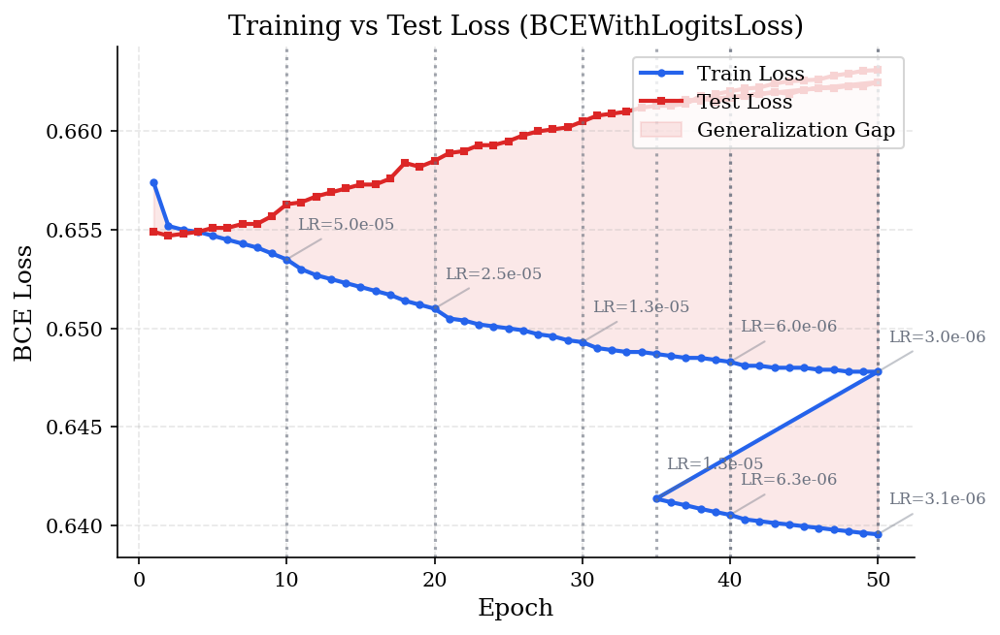
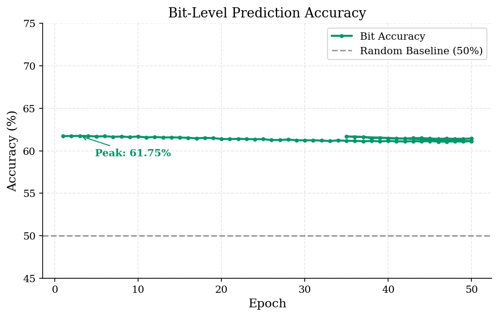
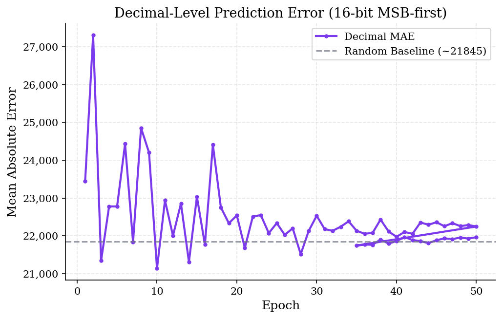
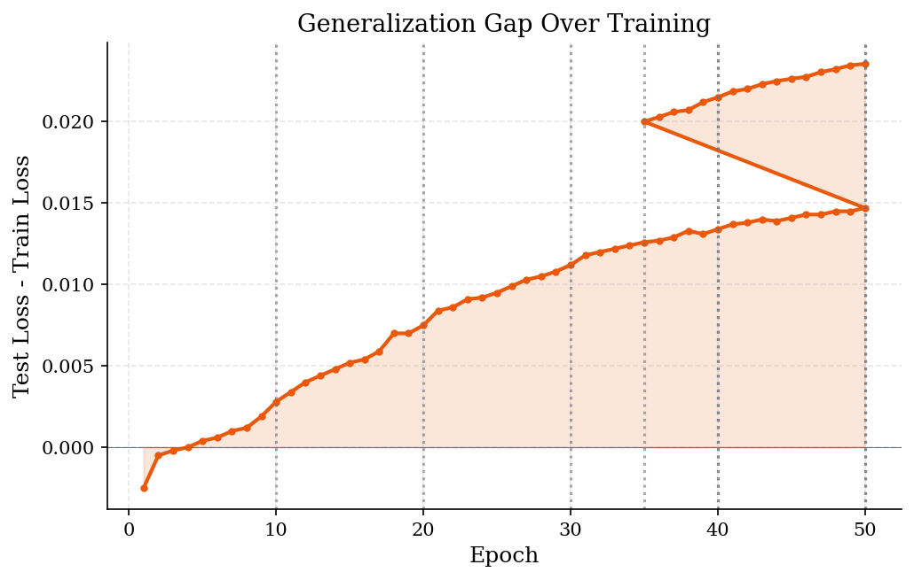

# Can a Neural Network Learn to Predict a PRNG?

Spoiler: not really -- and that's the point. This project trains a **differentiable logic gate network** to predict the next output of a 16-bit [PCG (Permuted Congruential Generator)](https://www.pcg-random.org/paper.html) from a sliding window of previous outputs. The network uses **learned soft AND/OR/XOR gates** instead of traditional activations, which is a natural fit for attacking a bit-manipulation algorithm. The goal was to see whether a neural architecture that mirrors the structure of bitwise computation could find exploitable patterns in a well-regarded PRNG.

## Summary

- **Generator**: 16-bit PCG-XSH-RR with 32-bit state, full-period sequence of 65,536 outputs
- **Architecture**: Alternating `Linear(64 -> 256)` and `DiffLogicLayer(256 -> 64)` blocks, 3 layers deep, ~52.7K trainable parameters
- **Core idea**: Each `DiffLogicLayer` learns per-bit soft selections over `{AND, OR, XOR}` gates via softmax, then folds 4 input timesteps sequentially to respect temporal ordering
- **Data representation**: Each 16-bit output is encoded as a bipolar bit vector $\in \{-1, 1\}^{16}$, mapped to $\{0, 1\}$ for the logic gate network
- **Training**: BCEWithLogitsLoss, Adam optimizer ($\text{lr} = 10^{-4}$), StepLR decay ($\gamma = 0.5$ every 10 epochs), 50 epochs
- **Infrastructure**: Dockerized for AWS Batch, S3-backed dataset and result storage

## How to use

**`data.py`** -- Generates the PCG sequence. Produces a 65,536-row CSV of bipolar bit vectors.

```bash
python data.py
```

**`network.py`** -- Trains the DiffLogicNet. Logs epoch-level metrics to `training_log.txt`.

```bash
python network.py
```

The `USE_LOGIC_GATE_NETWORK` flag at the top of `network.py` controls whether inputs are binarized to `{0, 1}` for the logic gate path. The codebase also contains an unused `SineLayer` (SIREN-style periodic activation) from an earlier architecture attempt.

**Docker** -- For cloud training via AWS Batch:

```bash
docker build -t pcrng-approx .
docker run -e AWS_ACCESS_KEY_ID=... -e AWS_SECRET_ACCESS_KEY=... pcrng-approx
```

The entrypoint pulls `data.csv` from S3 (`s3://pcrng-approx-dataset`), trains, and uploads results keyed by the Batch job ID.

## Architecture

The network alternates between dense linear projections and differentiable logic layers:

```
Input: (batch, 64)    -- 4 timesteps x 16 bits, flattened
  |
  Linear(64, 256)
  |
  DiffLogicLayer(256 -> 64)   -- learns soft {AND, OR, XOR} per bit
  |
  Linear(64, 256)
  |
  DiffLogicLayer(256 -> 64)
  |
  Linear(64, 256)
  |
  DiffLogicLayer(256 -> 64)
  |
  Linear(64, 16)
  |
Output: (batch, 16)   -- predicted next bit vector
```

The key insight in `DiffLogicLayer` is the **sequential fold**. Instead of processing all 4 input vectors in parallel, it chains them:

$$h_1 = \text{gate}_0(v_0, v_1), \quad h_2 = \text{gate}_1(h_1, v_2), \quad \text{out} = \text{gate}_2(h_2, v_3)$$

Each gate step is a soft mixture of AND, OR, and XOR, weighted by a learned softmax distribution per bit. This preserves the temporal dependency chain -- $v_3$ sees context from all prior timesteps through $h_2$, which is important because PCG's state transition is sequential.

## Results

<p align="center">
  
  
</p>

<p align="center">
  
  
</p>

- **Peak bit accuracy**: 62.4% at epoch 3, declining to ~61.4% by epoch 50
- **Random baseline**: 50% bit accuracy, ~21,845 decimal MAE
- **Best decimal MAE**: ~19,785 (epoch 4), settling around ~21,900 -- essentially at baseline
- **Generalization gap**: Steadily widening from epoch 1, reaching ~0.024 by epoch 50

**Metric definitions:**

- **Bit accuracy**: Fraction of individual bits predicted correctly across the 16-bit output vector (sigmoid threshold at 0.5)
- **Decimal MAE**: Mean absolute error after converting predicted and target bit vectors to unsigned 16-bit integers via MSB-first encoding ($\sum_{i=0}^{15} b_i \cdot 2^{15-i}$)

## Analysis

- **The network beats random on bits but not on numbers.** 62% bit accuracy sounds like the network found something, but the decimal MAE hovers at the random baseline (~21,845). This means the network learned to exploit the **marginal bit bias** in PCG-XSH-RR's lower bit positions -- the LSB has a mean of -0.47 instead of 0.00 -- but not any sequential dependency. It is predicting the per-bit base rate, not the next state.

- **The generalization gap tells the story.** Train loss keeps dropping while test loss flatlines and diverges. The model memorizes training sequences without learning the underlying state transition. This is exactly what you'd hope to see if you designed the PRNG well.

- **LR decay doesn't help.** The StepLR schedule halves the learning rate at epochs 10, 20, 30, and 40. Each step briefly slows the train loss descent but has no visible effect on test performance. The model ran out of learnable signal early.

- **The sequential fold architecture is sound but starved.** With only a window of 4 timesteps into a 32-bit state machine, the network sees 64 bits of output but needs to reconstruct a 32-bit hidden state that has been through a multiply-and-add. The XSH-RR output function specifically destroys the information the network would need -- that's the whole point of the permutation step.

## Process

1. I started with a standard MLP and SIREN (sinusoidal representation network) layers, thinking the periodic activations might resonate with the modular arithmetic in PCG. The `SineLayer` class in `network.py` is a remnant of that approach. It didn't work -- the sine activations made training unstable and the loss surface was full of local minima.

2. I switched to the differentiable logic gate approach after reading about [differentiable logic gate networks](https://arxiv.org/abs/2210.08277). Since PCG is fundamentally a bitwise algorithm (xorshift, rotation, multiply), a network that learns compositions of AND/OR/XOR felt like it should have a structural advantage. The `DiffLogicLayer` implements this with softmax-weighted gate selection per bit.

3. The first version of `DiffLogicLayer` processed all 4 input vectors independently and concatenated, which threw away temporal order. I restructured it as a sequential fold ($v_0, v_1 \rightarrow h_1 \rightarrow h_2 \rightarrow \text{out}$) to accumulate state. This did improve convergence speed but didn't change the ceiling.

4. I encoded outputs as bipolar vectors $\{-1, 1\}$ in the data generator for potential use with Hopfield-style energy models, then mapped to $\{0, 1\}$ at the dataset level when the logic gate network needed it. In hindsight, I should have just generated $\{0, 1\}$ directly and skipped the remapping.

5. I Dockerized the pipeline for AWS Batch to run longer sweeps across hyperparameters. The `entrypoint.sh` pulls data from S3, trains, and pushes results back. The batch job ID is used as the experiment key.

## Final notes

The main takeaway is that **~62% bit accuracy on a PRNG is not meaningful prediction** -- it's marginal bias exploitation. A good PRNG is specifically designed so that no polynomial-time algorithm can distinguish its output from true randomness, and a 52K-parameter neural network is very much polynomial-time. The network essentially learned "the lower bits are slightly biased toward 0" and stopped there.

If I were to push this further, I'd try:

- **Larger context windows** -- 4 timesteps is a very narrow view of a 32-bit state. The information-theoretic lower bound suggests you need at least 2 consecutive full outputs to reconstruct the state.
- **Direct state recovery** -- Instead of predicting the next output, train a network to recover the 32-bit internal state from a sequence of outputs. This reframes the problem as inversion rather than extrapolation.
- **Weaker PRNGs first** -- Validate the architecture on something attackable (LCG, xorshift32) before trying PCG. If the differentiable logic gates can't crack a raw LCG, the architecture has a deeper problem.
- **Attention over the bit dimension** -- The current architecture treats each bit position independently in the gate layer. Cross-bit attention might help the network learn the rotation step in XSH-RR.

The honest conclusion is that the architecture works as designed -- but "as designed" means it's a 52K-parameter function approximator going up against 2^32 possible states. The PRNG wins.
